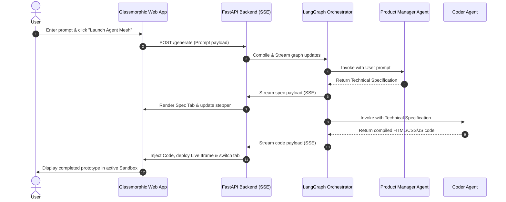

# 🤖 AI Multi-Agent Studio

> An elegant, real-time frontend orchestration engine powered by **LangGraph**, **FastAPI Server-Sent Events (SSE)**, and specialized AI agent mesh. Build, scope, and preview pristine modern web interfaces instantly from single natural language prompts.

---

## 🌌 Overview

The **AI Multi-Agent Studio** is a collaborative AI workspace that coordinates two specialized developer personas using a structured state-machine workflow to design, structure, and deploy standalone web prototypes. 

The studio features a **dual-agent collaboration cycle**:
1. **The Product Manager & UI Designer (scoper):** Translates raw user requests into an exhaustive, multi-tier layout and interface specification specifying styling design tokens, responsive layout guidelines, and interactive behaviors.
2. **The Frontend Engineer (coder):** Consumes the scoped specification and synthesizes production-ready, standalone, and responsive frontends written in single-file standard `HTML`, embedded modern `CSS` styling, and fully active `JavaScript`.

---

## 🏗️ Architecture & Orchestration

The system consists of a robust Python backend delivering low-latency SSE streams, linked to a custom premium dark-mode glassmorphic single-page app (SPA) running in the browser.

### Workflow Sequence Diagram



---

## 📂 Project Structure

The project has been modularized to separate configuration, backend endpoints, and LangGraph workflow orchestration while maintaining a single-file fallback implementation.

```
.
├── app/                     # Modular backend application
│   ├── __init__.py          # Package initializer
│   ├── agents.py            # LangChain Gemini model factory configuration
│   ├── config.py            # Pydantic Settings model with env validation
│   ├── graph.py             # LangGraph state schema, system personas, and worker nodes
│   └── routes.py            # FastAPI endpoints, CORS, SSE streams & static asset serving
├── .env                     # Local environment variables configuration
├── .gitignore               # standard git ignore file matching
├── index.html               # Premium glassmorphic single-page frontend application
├── main.py                  # Standalone standalone script (supports local Ollama, OpenRouter, and Gemini)
├── pyproject.toml           # Project metadata, Python dependencies, and UV setup
└── uv.lock                  # UV package manager lockfile
```

---

## 🛠️ Getting Started

### Prerequisites

- **Python**: `>= 3.13`
- **UV Package Manager** (highly recommended for lightning-fast setups)

### 1. Clone & Set Up Directory

Clone the repository and navigate to the project directory:

```bash
cd frontend-ai-agents
```

### 2. Environment Installation

#### Option A: Using `uv` (Recommended)
Sync the virtual environment and install all dependencies:
```bash
uv sync
```

#### Option B: Using standard `pip` & `venv`
Create a virtual environment, activate it, and install required libraries:
```bash
python -m venv .venv
source .venv/bin/activate
pip install fastapi langchain-openai langchain-openrouter langgraph pydantic python-dotenv uvicorn
```

### 3. Environment Configuration

Create a `.env` file in the root directory to store your API configuration:

```env
LLM_PROVIDER=gemini
GEMINI_API_KEY=your_google_gemini_api_key_here
```

> [!NOTE]
> - The **modular application** (`app/`) is optimized to run with Google's native Gemini API using the `gemini-2.5-flash` model.
> - The **standalone fallback** (`main.py`) supports alternative providers like `ollama` (running local `llama3.2`) and `openrouter` (running `claude-3-haiku` & `qwen3-coder-next`).

---

## 🚀 Running the Studio

### 1. Launching the Modular App (Standard Setup)

Run the service using Uvicorn to serve both the FastAPI backend and the static HTML frontend:

```bash
uvicorn app.routes:api --host 0.0.0.0 --port 8000 --reload
```

### 2. Launching the Standalone Script (All-in-One Setup)

Alternatively, run the standalone single-file server:

```bash
python main.py
```

### 3. Open the UI Studio

Once the server has successfully booted, navigate to:

```
http://localhost:8000
```

---

## � Documentation

Comprehensive guides and resources for development, security, and deployment:

- **[Development Guide](docs/DEVELOPMENT.md)** - Project structure, configuration, running tests, debugging, best practices, and contributing guidelines.
- **[Security Guide](docs/SECURITY.md)** - Security features, best practices, implementation details, monitoring, and recommendations.
- **[Code Review Fixes Summary](docs/FIXES_SUMMARY.md)** - Summary of all improvements addressing code review findings.
- **[MCP Status](docs/MCP_STATUS.md)** - MCP server status, integration options, and recommendations.

---

## 📡 Model Context Protocol (MCP) Server

Expose secure filesystem tools directly to external AI editors and clients (e.g., **Cursor**, **Claude Desktop**) using the integrated **Model Context Protocol (MCP)** server:

### 1. Exposed Tools
* `write_to_file(path: str, content: str) -> str`: Writes generated code to a relative file path inside the safe `./workspace` folder.
* `list_files(directory: str) -> list[str]`: Lists the files currently available in the active workspace directory.

### 2. Start the MCP Server
You can launch the stdio-based server using Python:
```bash
.venv/bin/python app/mcp_server.py
```

### 3. Client Integration (Cursor / Claude Desktop)
Add the following configuration to your MCP settings file (e.g., `claude_desktop_config.json` or in Cursor's MCP settings panel):

```json
{
  "mcpServers": {
    "frontend-studio-mcp": {
      "command": "/home/shashi/Workspace/frontend-ai-agents/.venv/bin/python",
      "args": ["/home/shashi/Workspace/frontend-ai-agents/app/mcp_server.py"]
    }
  }
}
```

> [!NOTE]
> See [docs/MCP_STATUS.md](docs/MCP_STATUS.md) for current MCP integration status and recommendations.

---

## 🎨 Frontend Studio Features

The user interface has been custom-crafted using premium glassmorphism designs to ensure absolute visual excellence and a futuristic aesthetic:

- **Premium Google Fonts**: Utilizes `Plus Jakarta Sans` for sleek content layout and `JetBrains Mono` for pristine code representation.
- **Micro-Animations**: Features custom CSS shimmer loading animations, glowing buttons, floating empty state graphics, and a pulsing live status indicator.
- **Task Presets**: Quickly execute pre-configured visual prompts (e.g. Glassmorphic Pomodoro Timer, Elegant Weather Dashboard, Finance Wallet UI) with a single click.
- **Tabbed Live Workspace**:
  - **Technical Specification**: Basic markdown rendering of the PM scoping roadmap.
  - **Generated Code**: Visual code display featuring real-time copy-to-clipboard actions and direct raw source downloads.
  - **Live Preview Sandbox**: A safe, sandbox-secured `iframe` container that compiles and executes the generated frontend prototype instantly on page stream compilation.
